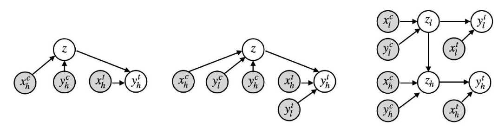
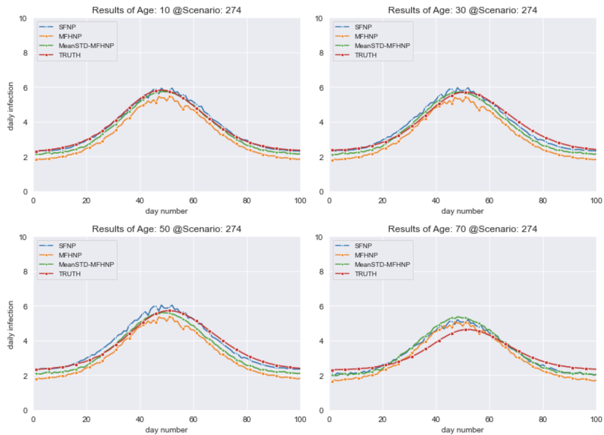

<!---

<em>IMAGE TITLE</em>

-->

# Abstract/Motivation

For simulations in different fields such as climatology and epidemiology, models can learn complex systems very accurately, with immense processing power and huge amounts of storage. These various models use input-output relationships; inputs can range from virus and disease characteristics like severity and transmissibility (in the case of epidemiology modeling) to behavioral responses (changes in contact rates). Outputs of such models describe the evolutions of the inputs and tasks, such as a time series representation of a particular virus. 

While using models like neural processes, a type of model used to define probability distributions in conjunction with multi-fidelity data gives us fairly flexible and efficient solutions, they are incredibly computationally expensive. This project introduces active learning to these modeling tasks; active learning is a technique that determines which training data to train on next via a reward function, further improving model stability. This project explores the possibilities of using active learning on various models to improve accuracy and in turn provide a better method of epidemiology modeling with time series data. 

# Data
The data used for this project contains roughly 7000 high-dimensional complex simulations for the epidemiology modeling task at hand. The data stored is broken up into 109 different scenarios across different locations in the United States, Europe, and China, that is collected through macro and micro polls data. The low-fidelity data that is used contains an aggregation of data across 18 different age groups, while the high-fidelity data contains 85 different age groups.

# Models
The models utilized for this project were as follows:

## Gaussian Processes
The Gaussian Processes used in the project were simply used as baselines to prove that neural processes are far superior. These baselines are the nonlinear auto-regressive multi-fidelity GP regression model (NARGP) and single-fidelity Gaussian Processes (SFGP) model (under assumption of data independence at respective fidelity).

## Neural Processes
This project was heavily dependent on neural processes, as it was the primary model type that was used. The single-fidelity neural process (SFNP) was used as a baseline to show the difference between the more complex neural processes. The multi-fidelity hierarchical neural process (MFHNP) was used as a reference to this project's goal; however, this project simply builds on top of it. Finally, there were two new models: Mean-MFHNP, and Mean-STD-MFHNP; these two neural process models used two acquisition functions, namely low-level-mean and maximum-mean-standard-deviation for active learning. These two models were the crux of this project, and are the best performing models out of them all. 

The image above shows the single-fidelity neural process graph (left), as well as the multi-fidelity hierarchical neural process graph (right). The graph in the middle corresponds to the multi-fidelity neural process, which is not directly relevant to this project.

# Methods
*Acquition Functions
              * Low Level Mean
                  * This aquisition function uses the low-level mean of the latent variables in order to infer zh. For every parameter \theta, we generate a set of predictions; hence for a given subset of T data with D dimensions in each data point, the mean is computed for a given step (in our application, days) t and feature d. We then calculate the low-level-mean by averaging the mean \mut,d.
              * Maximum Mean Standard Deviation

# Results

# References
\[1\] Dongxia Wu, Matteo Chinazzi, Alessandro Vespignani, Yi-An Ma, and Rose Yu. 2022. [Multi-fidelity Hierarchical Neural Processes](https://par.nsf.gov/servlets/purl/10347794). In Proceedings of the 28th ACM SIGKDD Conference on Knowledge Discovery and Data Mining (KDD ’22), August 14–18, 2022, Washington, DC, USA. ACM, New York, NY, USA, 10 pages. https://doi.org/10.1145/3534678.3539364

\[2\] Wu, D., Niu, R., Chinazzi, M., Vespignani, A., Ma, Y. A., & Yu, R. (2021). [Deep Bayesian Active Learning for Accelerating Stochastic Simulation](https://arxiv.org/pdf/2106.02770.pdf). arXiv preprint arXiv:2106.02770. 

\[3\] Garnelo, M., Schwarz, J., Rosenbaum, D., Viola, F., Rezende, D. J., Eslami, S. M., & Teh, Y. W. (2018). [Neural processes](https://arxiv.org/pdf/1807.01622.pdf). arXiv preprint arXiv:1807.01622.
